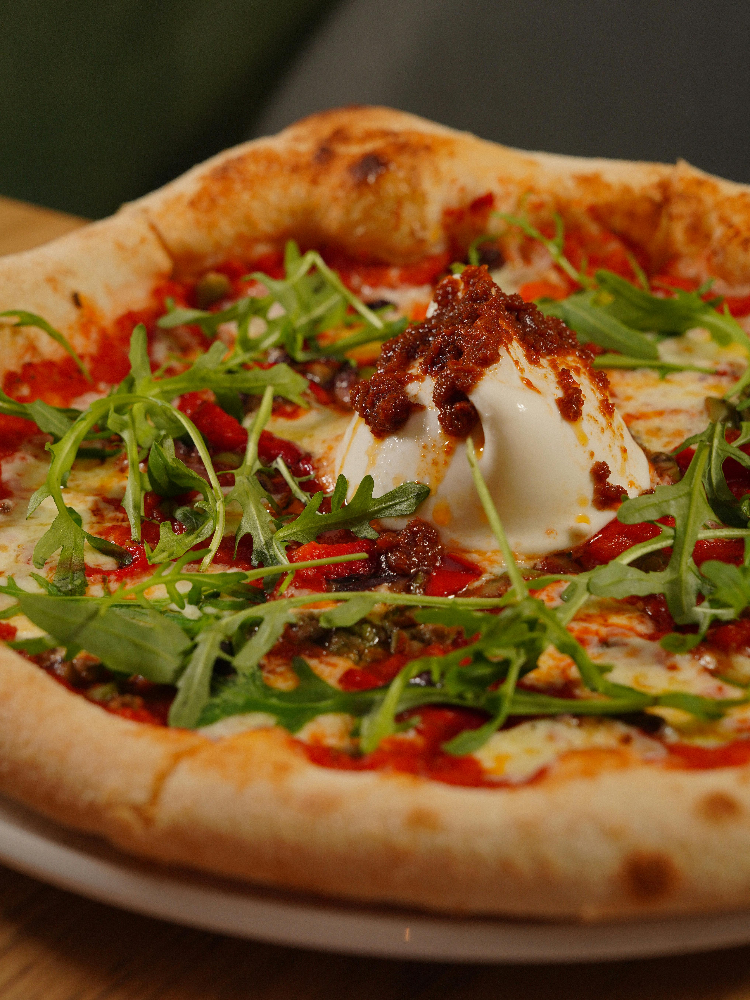

# SCHOOL PROJECT - PIZZARIA
For a school project I made this take-away website where you can order pizza.

## About The Project

This project is an e-commerce web application that allows users to browse and purchase pizzas. It includes user registration, login, and order management features. The application is built using an MVC (Model-View-Controller) architecture to ensure a clean, maintainable code structure.

**Key Features:**
- [x] **Product Listings:** The application retrieves a list of products (pizzas) from a database and displays them on the website as cards, showing the product name, price, and an image.
- [x] **Shopping Cart:** Users can add products to their shopping cart, and the cart data is stored in the session to persist during the browsing session. The quantity of each product in the cart can be adjusted, and items are removed when their quantity reaches zero.
- [x] **Order Management:** Users can view and modify their cart before completing the order. After logging in, users can finalize their order, choose a delivery time (at least 30 minutes after the current time), and place their order. Order details are stored in the database for processing.
- [x] **User Authentication:** Users must log in to complete the purchase. New users can register and their information is stored in the database for future use.

## Build With
* PHP
* HTML
* CSS
